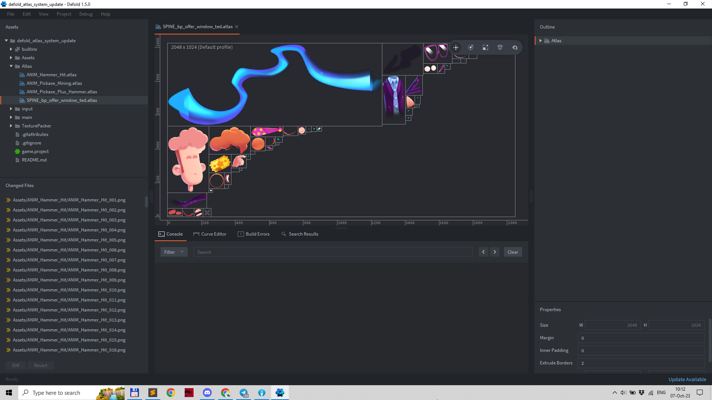

# Defold Atlas System Update

## Design Document & Problem Description

### Case 01 Flipbook
---

In the MergeVille game, 80% of the animations in the game are flipbook animations, as we create all these animations in Blender and get a png sequence.

**Why Flipbook animation?**
Some of the animations are very complex, e.g. `ANIM_AnimalCow_Tier1_InProgress_EatingWheat`, and other solutions have a number of disadvantages for this art pipeline:

**• Animation via Spine**
Even though we use 2D graphics in the game, we produce all game Assets in 3D and render them using a special pipeline, so animating directly in Blender simplifies the process. What's more, we don't have to pay for Spine tools or increase our animation staff to create Spine animations.

**• Animation via 3D Model**
Due to the peculiarities of the graphics, in particular the strokes on the model, it would take a lot of time and research to replicate such an effect on a 3D model, so we rejected the idea.

---

There are animations where the object almost does not change its position in space ANIM_AnimalCow_Tier1_InProgress_EatingWheat, this type of animation can be optimised quite poorly.

Another type of animation where a small sprite changes its position and perspective in space. This type of animation will be the main value when using TexturePackers.

**Pickaxe and Hammer animations packed in Defold atlas**

**Pickaxe and Hammer animations packed by Texture Packer**

TexturePacker also has the option to detect identical sprites, which can further reduce the size of the atlas. For some animations, this type of optimisation can reduce the size by 50%.
**The identical Sprites that reduce size of final Atlas**

### Case 02 Spine
---

**Spine Case in Defold**

**Tiny fix of TexturePacker**

**Using polygons**

### Current Workaround

A few months ago, a possible solution to the problem of trimming flipbook animations was developed that covered our needs.

However, supporting this engine solution is now an impossible task for us, so we have frozen this feature and stopped using it.

You can check the solution here 👉 https://forum.defold.com/t/support-for-texturepacker-and-trimmed-images/72741

---